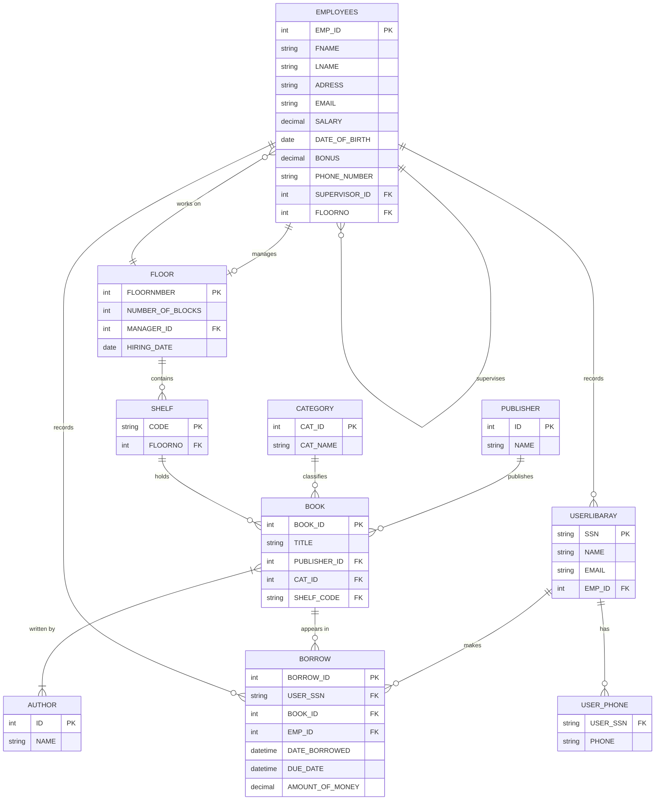

# Library Management System — Database Design

A relational database design for a library that tracks employees, floors, users, books,
authors, publishers, categories, shelves, and book-borrowing transactions.

Built as a database design assignment (ASP.NET / SQL Server track) — E-R modeling,
relational mapping, and T-SQL implementation on Microsoft SQL Server.

## Entity-Relationship Diagram



## Business Rules

- Every employee has a supervisor (self-referencing relationship) — except the top of the hierarchy.
- Each floor has exactly one manager (an employee), recorded with a `HIRING_DATE`; each
  employee works on exactly one floor (`FLOORNO`) — these are two distinct relationships,
  not one.
- Each library user is registered by one employee (`EMPLOYEES → USERLIBARAY`), but a book
  **borrow** is its own transaction, separately tied to the employee who processed it
  (`EMPLOYEES → BORROW`) — a user can be registered by one employee and later borrow a
  book while a different employee is on shift.
- A user can have multiple phone numbers (`USER_PHONE`, multivalued attribute).
- A book has exactly one publisher and one category, but may have multiple authors, and an
  author may have written multiple books (`BOOK_AUTHOR`, many-to-many).
- Every book sits on exactly one shelf; every shelf belongs to exactly one floor.

## Database Schema (11 tables)

| Table | Purpose |
|---|---|
| `FLOOR` | Physical floors of the library (floor number, block count, manager, hiring date) |
| `EMPLOYEES` | Staff, with self-referencing `SUPERVISOR_ID` and `FLOORNO` |
| `USERLIBARAY` | Library members (SSN, name, email, registering employee) |
| `USER_PHONE` | Multivalued phone numbers per user |
| `SHELF` | Physical shelves, one per floor |
| `PUBLISHER` | Book publishers |
| `CATEGORY` | Book categories |
| `AUTHOR` | Book authors |
| `BOOK` | Books (title, publisher, category, shelf) |
| `BOOK_AUTHOR` | Junction table resolving the many-to-many Book↔Author relationship |
| `BORROW` | Borrow transactions (user, book, recording employee, dates, amount) |

## Notable Design Decisions

- **Circular reference (`EMPLOYEES` ↔ `FLOOR`)**: an employee must belong to an existing
  floor, and a floor must have an existing manager. Resolved at the DDL level by creating
  `FLOOR` first without the manager FK, creating `EMPLOYEES` next, then adding
  `FK_Floor_Manager` afterward — and at the data level with a temporary
  `NOCHECK CONSTRAINT` / `WITH CHECK CHECK CONSTRAINT` pass.
- **`BORROW` as an associative entity**: resolves what is conceptually a ternary
  relationship (User–Book–Employee) rather than a simple many-to-many, since the recording
  employee is part of the transaction data itself.
- **`BORROW_ID` as a surrogate key**: a natural key of `(USER_SSN, BOOK_ID)` isn't unique on
  its own — the same user can borrow the same book more than once on different dates.
- **`MANAGER_ID UNIQUE`**: enforces that the Employee↔Floor "manages" relationship stays 1:1.

## Project Files

| File | Description |
|---|---|
| `Library_Database_Schema.sql` | DDL — `CREATE TABLE` statements for all 11 tables with constraints |
| `Library_Sample_Data.sql` | Sample `INSERT` statements for all tables, in dependency order |
| `README.md` | This file |

## Setup

1. Open the project in SQL Server Management Studio (SSMS) or Azure Data Studio.
2. Run `Library_Database_Schema.sql` to create the database and all tables.
3. Run `Library_Sample_Data.sql` to populate it with sample data.

```sql
-- Example queries
SELECT FNAME, LNAME FROM EMPLOYEES WHERE FLOORNO = 1;              -- staff on Floor 1
SELECT TITLE FROM BOOK WHERE SHELF_CODE = 'A1';                    -- books on shelf A1
SELECT * FROM BORROW WHERE DUE_DATE < GETDATE();                  -- overdue borrows
```

## Author

**Abdullah Mhrous** — Computer Science student, Kafr El-Sheikh University
DEPI Full Stack .NET Track
[github.com/bodex-9](https://github.com/bodex-9)
